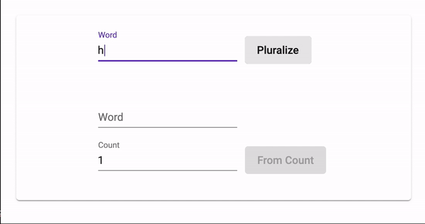

# ng-pluralize #

[](https://www.npmjs.com/package/ng-pluralize/)
[](https://www.npmjs.com/package/ng-pluralize)
[](https://www.npmjs.com/package/ng-pluralize)



## Index ##

* [About](#about)
* [Setup](#setup)
* [Usage](#usage)
* [Documentation](#documentation)
* [Contributing](#contributing)
* [Issues](#issues)
* [Deploy](#deploy)

## About ## 

An Angular 2+ module to pluralize and singularize any word.

* Try out [the demo](https://ng-pluralize.jrquick.com) to see it in action!
* Visit [my website](https://jrquick.com) for other cool projects!

## Setup ##

### Install Node ###

```
npm install ng-pluralize --save
```

### Import module ###

* Import `NgPluralizeModule` by adding the following to your parent module (i.e. `app.module.ts`):

    ```
    import { NgPluralizeModule } from 'ng-pluralize';

    @NgModule({
      ...
      imports: [
        NgPluralizeModule,
        ...
      ],
      ...
    })
    export class AppModule {}
    ```
  
## Usage ##

### Use Service ###

```typescript
import {NgPluralizeService} from 'ng-pluralize';

@Injectable()
export class TechCheckService {
  constructor(
    private service:NgPluralizeService
  ) {
    this.service.singularize('dogs'); // dog
    this.service.pluralize('cat'); // cats
    this.service.fromCount('taco', 99); // tacoes
  }
}
```

## Documentation ##

* `singularize()` - Convert a word into it's singular form (ie dogs to dog)
* `pluralize()` - Convert a word into it's plural form (ie cat to cats)
* `fromCount(word, count, inclusive)` - Get the current internet speed in KBPS (kilobytes per second).
    * `word: string` - The word to pluralize
    * `count: number` - How many of the word exist
    * `inclusive: boolean` - Whether to prefix with the number (e.g. 3 ducks)

### Examples ###

```javascript
pluralize('test') //=> "tests"
pluralize('test', 0) //=> "tests"
pluralize('test', 1) //=> "test"
pluralize('test', 5) //=> "tests"
pluralize('test', 1, true) //=> "1 test"
pluralize('test', 5, true) //=> "5 tests"
pluralize('蘋果', 2, true) //=> "2 蘋果"

// Example of new plural rule:
pluralize.pluralize('regex') //=> "regexes"
pluralize.addPluralRule(/gex$/i, 'gexii')
pluralize.pluralize('regex') //=> "regexii"

// Example of new singular rule:
pluralize.singularize('singles') //=> "single"
pluralize.addSingularRule(/singles$/i, 'singular')
pluralize.singularize('singles') //=> "singular"

// Example of new irregular rule, e.g. "I" -> "we":
pluralize.pluralize('irregular') //=> "irregulars"
pluralize.addIrregularRule('irregular', 'regular')
pluralize.pluralize('irregular') //=> "regular"

// Example of uncountable rule (rules without singular/plural in context):
pluralize.pluralize('paper') //=> "papers"
pluralize.addUncountableRule('paper')
pluralize.pluralize('paper') //=> "paper"

// Example of asking whether a word looks singular or plural:
pluralize.isPlural('test') //=> false
pluralize.isSingular('test') //=> true

// Example of adding a token exception whose case should not be restored:
pluralize.pluralize('promo ID') //=> 'promo IDS'
pluralize.addRestoreCaseException('IDs')
pluralize.pluralize('promo ID') //=> 'promo IDs'
```

## Contributing ##

### Thanks ###

* [blakeembrey](https://github.com/blakeembrey)
* [jrquick17](https://github.com/jrquick17)

## Issues ##

If you find any issues feel free to open a request in [the Issues tab](https://github.com/jrquick17/ng-pluralize/issues). If I have the time I will try to solve any issues but cannot make any guarantees. Feel free to contribute yourself.

## Deploy ##

### Demo ###
    
* Run `npm install` to get packages required for the demo and then run `npm run demo` to run locally.

### Generate Docs ###

* Run `npm run docs:build`

#### Update Version ###
    
* Update version `package.json` files in both the root and `dist/` directory following [Semantic Versioning (2.0.0)](https://semver.org/).

### Build ###

* Run `npm run build` from root.

#### Test ####

* Copy `dist/` contents into `demo/node_modules/ng-pluralize/`
    * Run from root:  `cp -fr dist/* demo/node_modules/ng-pluralize/`
* Run `ng serve` from `demo/`
* Run `ng build --prod` from `demo/`

#### NPM Release ####

* Run `npm publish` from `dist/` directory.

#### Update Changelog ####

* Add updates to `CHANGELOG.md` in root.

## License

MIT
